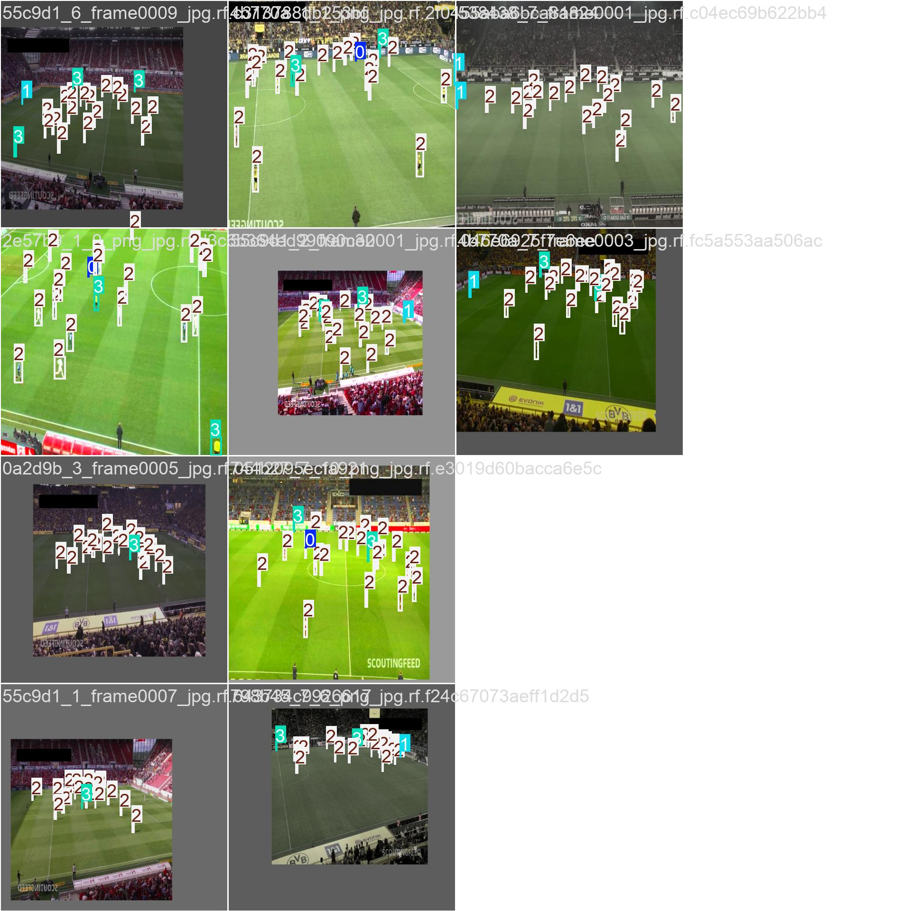

# Football_Objects_Detecttion
- Objective: Developed a real-time object detection system to identify key elements in football gameplay, including players, the football, and referees, using YOLOv11.
- Technology Stack: YOLOv11, Python, OpenCV, TensorFlow/PyTorch.
- Dataset: Curated and annotated a dataset consisting of football match footage, ensuring diverse scenarios and lighting conditions for robust detection.
Results/Evaluation Metrics: Present inside run/detects/train18.

# Sample Output:

